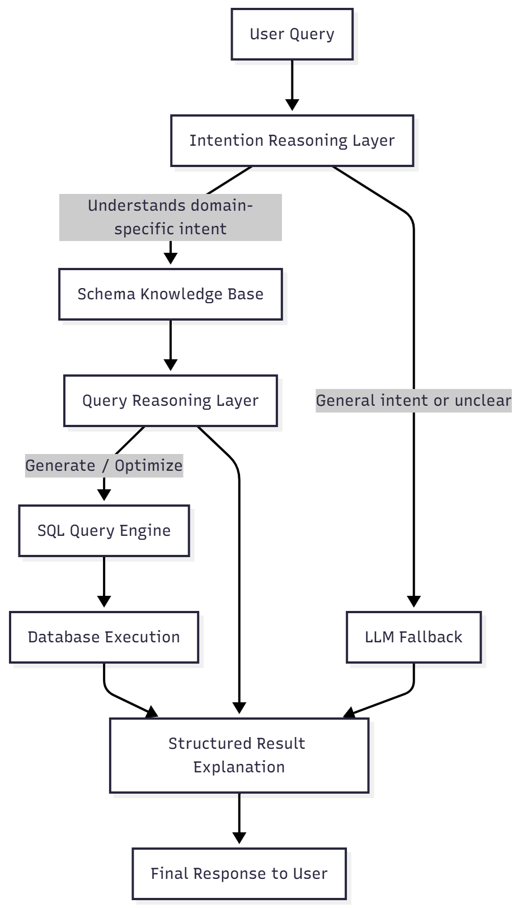

# Data Model Insight Accelerator

The **Data Model Insight Accelerator** is an intelligent query-generation and data-understanding framework that transforms natural-language questions into optimized database queries. It leverages schema-aware reasoning, multi-layered intent understanding, and LLM fallback to deliver accurate and meaningful insights from your database.

---

## Key Features

---

### 1. Schema Knowledge Base

- Stores database metadata (tables, columns, relationships, constraints).  
- Enhances contextual understanding and improves query accuracy.  
- Allows the system to reason using actual database structures instead of pure text predictions.  

---

### 2. Dual Reasoning Layers

#### a. Intent Reasoning Layer
Interprets what the user *means* and decides whether the request requires:

- SQL generation  
- Insight retrieval  
- Data explanation  
- LLM fallback for general or non-database questions  

#### b. Query Reasoning Layer

- Converts intent into structured query actions  
- Generates optimal SQL using schema information  
- Applies query optimization strategies  
- Ensures accuracy, correct joins, and valid filter logic  

---

### 3. LLM Fallback

If the user question is **too general**, **not database-specific**, or **non-technical**, the system delegates to an LLM to produce a helpful conversational response.

---

### 4. Execution + Post-Processing

- Executes the generated SQL on the database  
- Enhances results with explanations and human-readable insights  
- Returns a clean, structured final response to the user  

---

## How It Works

1. User asks a question (e.g., *“What are the top 5 customers by revenue?”*).  
2. **Intent Reasoning Layer** determines whether it is database-specific.  
3. The system queries the **Schema Knowledge Base** to understand tables and relationships.  
4. The **Query Reasoning Layer** generates and optimizes SQL.  
5. The SQL is executed on the target database.  
6. Results are enriched with insights and returned to the user.  
7. For general questions (e.g., *“Explain regression vs classification”*), the **LLM Fallback** generates the answer instead.

---

# Basic Flow Diagram
