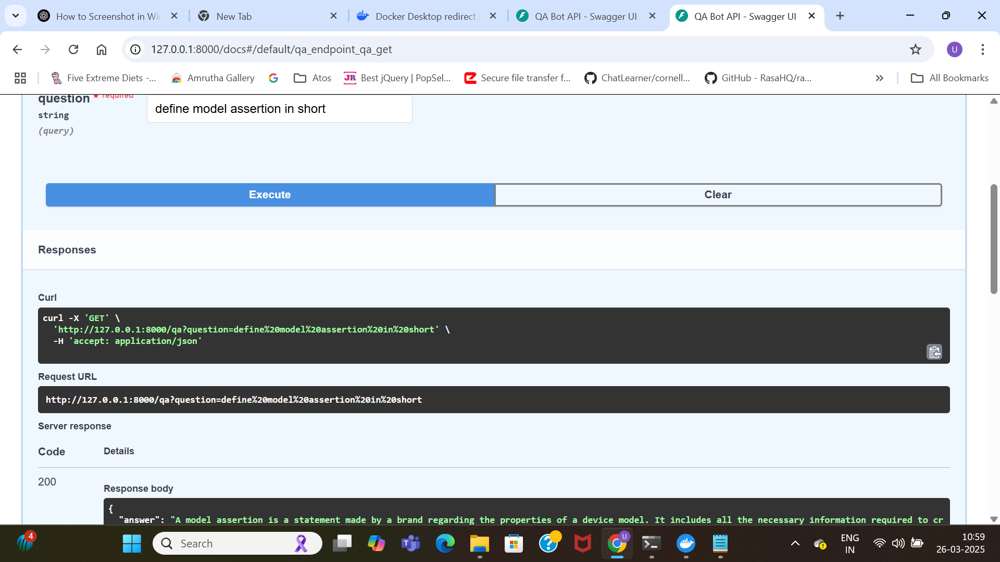
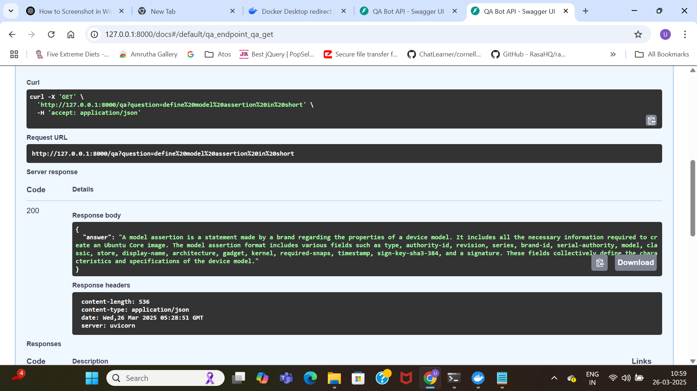
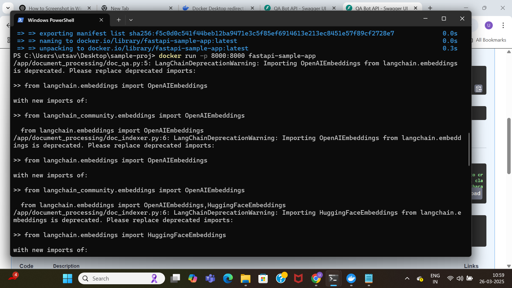
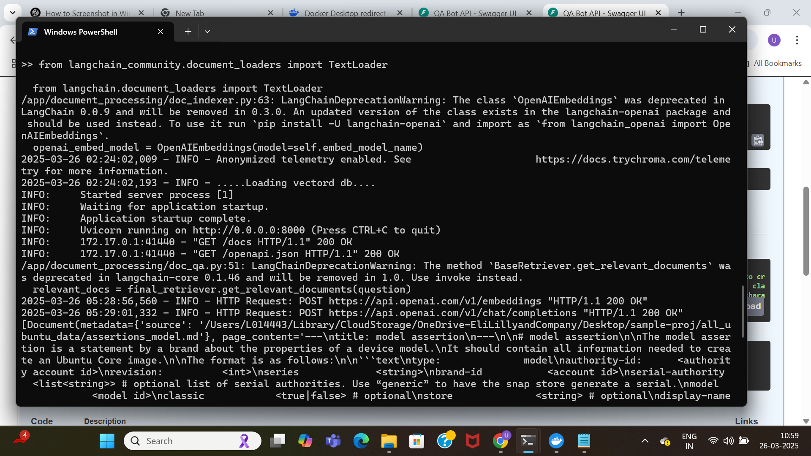

# ABB_Case_Study
# This is a simple experiment of a RAG bot based on Ubuntu docs.
# 
# - **Vector Database:** ChromaDB
# - **Chunking Strategy:** Due to time constraints, Recursive Character Text Splitting is used with a chunk size of 1000 characters and an overlap of 200 characters.
#   - For further improvement, a corrective agent can be implemented for better retrieval.
# - **Document Parsing:** Uses a Text Loader for parsing the document, as it's in Markdown (.md) format.
# - **LLM:** OpenAI (GPT-4.0 model)
# - **API Endpoint:** Created using FastAPI for efficient interaction.
# - **Containerization:** The service is containerized using Docker for seamless deployment and scalability.

